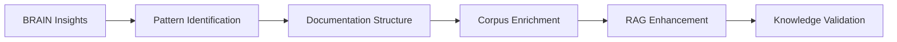
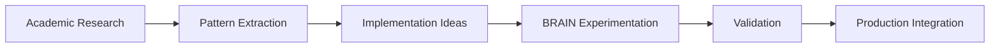

# 🧠 Bridge BRAIN ↔ DOC-UNIV-DEV
## Symbiose Intelligence Empirique ↔ Documentation Académique

### 🎯 **Mission du Bridge**
Assurer la **symbiose bidirectionnelle** entre l'intelligence empirique de BRAIN et la base documentaire académique de DOC-UNIV-DEV, créant un cycle d'apprentissage et d'amélioration continue.

---

## 🔄 **FLUX COGNITIF BIDIRECTIONNEL**

### **BRAIN → DOC-UNIV-DEV (Expérience → Structure)**



**Flux d'enrichissement** :
1. **Insights BRAIN** → Identification patterns émergents
2. **Structuration** → Transformation en documentation formelle
3. **Enrichissement Corpus** → Ajout chunks structurés RAG
4. **Validation Croisée** → Vérification cohérence théorie-pratique
5. **Intégration Ontologie** → Mise à jour relations conceptuelles

### **DOC-UNIV-DEV → BRAIN (Théorie → Application)**



**Flux d'application** :
1. **Recherche Académique** → Veille papers et innovations
2. **Extraction Patterns** → Identification patterns applicables
3. **Idées Implémentation** → Génération hypothèses BRAIN
4. **Expérimentation** → Tests contrôlés dans environnement BRAIN
5. **Intégration** → Déploiement solutions validées

---

## 📊 **MÉTRIQUES DE SYMBIOSE**

### **KPI Flux BRAIN → DOC**
- **Pattern Discovery Rate** : Nouveaux patterns/semaine identifiés
- **Documentation Coverage** : % insights BRAIN documentés
- **RAG Enrichment** : Chunks ajoutés depuis insights BRAIN
- **Validation Success** : % patterns validés théoriquement

### **KPI Flux DOC → BRAIN**  
- **Research Implementation** : Papers appliqués en production
- **Innovation Velocity** : Temps recherche → implémentation
- **Success Rate** : % recherches aboutissant à solutions
- **Cross-Validation** : Cohérence théorie-pratique mesurée

---

## 🛠️ **OUTILS ET PROCESSUS**

### **Synchronisation Automatique**

```yaml
sync_automation:
  schedule: "daily"
  triggers:
    brain_insights:
      - "New pattern discovered in BRAIN logs"
      - "Performance improvement documented"
      - "Architecture decision made"
    
    doc_updates:
      - "New paper added to corpus"
      - "Pattern documentation updated"
      - "Research recommendation generated"
  
  workflows:
    brain_to_doc:
      1. "Extract insights from BRAIN activity"
      2. "Generate documentation chunks"
      3. "Update RAG corpus"
      4. "Refresh ontology relationships"
    
    doc_to_brain:
      1. "Identify applicable research"
      2. "Generate implementation hypotheses"
      3. "Create BRAIN experiments"
      4. "Track validation results"
```

### **Interface Cognitive**

```python
# brain_doc_bridge.py
class BrainDocBridge:
    def __init__(self, brain_api, doc_api):
        self.brain = brain_api
        self.doc = doc_api
        self.sync_history = []
    
    def sync_brain_insights(self):
        """Synchroniser insights BRAIN vers DOC"""
        
        # Extraire insights récents
        insights = self.brain.get_recent_insights(days=7)
        
        for insight in insights:
            # Générer documentation
            doc_chunk = self.generate_documentation_chunk(insight)
            
            # Ajouter au corpus RAG
            self.doc.add_to_corpus(doc_chunk)
            
            # Mettre à jour ontologie
            self.doc.update_ontology_relationships(insight)
    
    def sync_research_applications(self):
        """Synchroniser recherche DOC vers BRAIN"""
        
        # Identifier recherche applicable
        applicable_research = self.doc.find_applicable_research(
            brain_context=self.brain.get_current_challenges()
        )
        
        for research in applicable_research:
            # Générer hypothèse d'implémentation
            hypothesis = self.generate_implementation_hypothesis(research)
            
            # Créer expérimentation BRAIN
            self.brain.create_experiment(hypothesis)
```

---

## 📈 **CYCLE D'AMÉLIORATION CONTINUE**

### **Rituel Hebdomadaire**

**Lundi** : Review insights BRAIN → identification patterns  
**Mercredi** : Recherche academic → génération hypothèses  
**Vendredi** : Validation croisée → mise à jour documentation  

### **Rituel Mensuel**
- **Audit qualité symbiose** : Cohérence théorie-pratique
- **Métriques impact** : ROI recherche et innovation velocity
- **Planning stratégique** : Priorités recherche selon besoins BRAIN

---

**Status** : ✅ **OPERATIONAL BRIDGE**  
**Version** : 1.0.0  
**Maintenance** : Continuous via automation + rituels