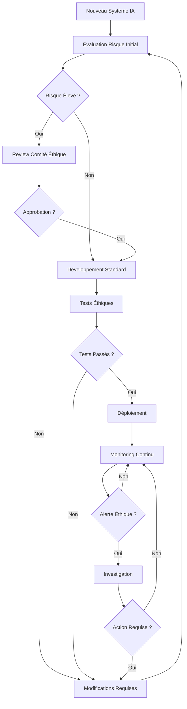

# 🌡️ Checklist Éthique IA - DOC-UNIV-DEV
## Gouvernance et Conformité Responsible AI

### 🎯 **Objectif de la Checklist**

Assurer que tous les systèmes IA développés dans l'écosystème DOC-UNIV-DEV respectent les **principes éthiques fondamentaux**, la **conformité légale**, et les **meilleures pratiques** de l'IA responsable.

---

## 📋 **CHECKLIST PHASE 1: CONCEPTION & DESIGN**

### **Évaluation Impact et Risques**

- [ ] **Analyse d'impact algorithmique**
  - [ ] Identification des populations impactées
  - [ ] Évaluation des risques de biais potentiels
  - [ ] Analyse des conséquences négatives possibles
  - [ ] Documentation des cas d'usage prévus
  - [ ] Évaluation de la proportionnalité de la solution

- [ ] **Respect des droits fondamentaux**
  - [ ] Conformité RGPD/GDPR (collecte, traitement, conservation)
  - [ ] Respect du droit à l'explication (explicabilité)
  - [ ] Respect du droit de rectification
  - [ ] Conformité avec les règlements locaux (AI Act EU)
  - [ ] Évaluation nécessité consentement explicite

- [ ] **Transparence et explicabilité**
  - [ ] Documentation claire du fonctionnement de l'IA
  - [ ] Capacité d'explication des décisions
  - [ ] Traçabilité des données utilisées
  - [ ] Documentation des limitations connues
  - [ ] Communication claire vers les utilisateurs finaux

### **Conception Inclusive et Équitable**

- [ ] **Diversité des données**
  - [ ] Représentativité des données d'entraînement
  - [ ] Équilibre des classes/catégories
  - [ ] Inclusion de perspectives diverses
  - [ ] Validation sur populations sous-représentées
  - [ ] Documentation des limitations de représentativité

- [ ] **Conception anti-biais**
  - [ ] Identification des variables sensibles
  - [ ] Stratégies de mitigation des biais
  - [ ] Tests de fairness intégrés
  - [ ] Métriques d'équité définies
  - [ ] Processus de correction continue

---

## 📋 **CHECKLIST PHASE 2: DÉVELOPPEMENT**

### **Qualité des Données**

- [ ] **Gouvernance des données**
  - [ ] Inventory complet des données utilisées
  - [ ] Documentation de la provenance
  - [ ] Vérification des droits d'utilisation
  - [ ] Classification de sensibilité (publique, interne, confidentielle)
  - [ ] Procédures de mise à jour des données

- [ ] **Qualité et nettoyage**
  - [ ] Détection et correction des erreurs
  - [ ] Gestion des données manquantes
  - [ ] Dé-doublonnage systmatique
  - [ ] Validation de la cohérence
  - [ ] Tests de qualité automatisés

- [ ] **Sécurité et confidentialité**
  - [ ] Anonymisation/pseudonymisation quand nécessaire
  - [ ] Chiffrement des données sensibles
  - [ ] Contrôle d'accès granulaire
  - [ ] Audit trail des accès aux données
  - [ ] Procédures de suppression sécurisée

### **Développement Responsable**

- [ ] **Tests de biais et fairness**
  - [ ] Tests de parité démographique
  - [ ] Tests d'égalité des chances
  - [ ] Tests de calibration par groupe
  - [ ] Analyse des faux positifs/négatifs par démographie
  - [ ] Tests d'adversarial fairness

- [ ] **Robustesse et sécurité**
  - [ ] Tests d'attaques adversariales
  - [ ] Évaluation de la robustesse aux perturbations
  - [ ] Tests de performance sous charge
  - [ ] Évaluation de la stabilité temporelle
  - [ ] Tests de résistance au poisoning

```python
# scripts/bias_testing.py
import pandas as pd
from aif360 import datasets, metrics
from sklearn.metrics import confusion_matrix

class BiasTestingSuite:
    def __init__(self, model, test_data):
        self.model = model
        self.test_data = test_data
    
    def test_demographic_parity(self, protected_attribute):
        """
        Test de parité démographique
        """
        predictions = self.model.predict(self.test_data)
        
        groups = self.test_data.groupby(protected_attribute)
        positive_rates = {}
        
        for group_name, group_data in groups:
            group_predictions = predictions[group_data.index]
            positive_rate = (group_predictions == 1).mean()
            positive_rates[group_name] = positive_rate
        
        # Calculer disparité
        max_rate = max(positive_rates.values())
        min_rate = min(positive_rates.values())
        parity_ratio = min_rate / max_rate
        
        return {
            "parity_ratio": parity_ratio,
            "passes_80_rule": parity_ratio >= 0.8,  # Règle des 80%
            "group_rates": positive_rates
        }
    
    def test_equalized_odds(self, protected_attribute, true_labels):
        """
        Test d'égalité des chances
        """
        predictions = self.model.predict(self.test_data)
        groups = self.test_data.groupby(protected_attribute)
        
        group_metrics = {}
        
        for group_name, group_data in groups:
            group_indices = group_data.index
            group_predictions = predictions[group_indices]
            group_true_labels = true_labels[group_indices]
            
            # Calculer TPR et FPR
            tn, fp, fn, tp = confusion_matrix(group_true_labels, group_predictions).ravel()
            tpr = tp / (tp + fn) if (tp + fn) > 0 else 0
            fpr = fp / (fp + tn) if (fp + tn) > 0 else 0
            
            group_metrics[group_name] = {"tpr": tpr, "fpr": fpr}
        
        # Vérifier écart TPR et FPR entre groupes
        tprs = [metrics["tpr"] for metrics in group_metrics.values()]
        fprs = [metrics["fpr"] for metrics in group_metrics.values()]
        
        tpr_diff = max(tprs) - min(tprs)
        fpr_diff = max(fprs) - min(fprs)
        
        return {
            "tpr_difference": tpr_diff,
            "fpr_difference": fpr_diff,
            "equalized_odds_satisfied": tpr_diff < 0.1 and fpr_diff < 0.1,
            "group_metrics": group_metrics
        }
```

---

## 📋 **CHECKLIST PHASE 3: DÉPLOIEMENT**

### **Déploiement Responsable**

- [ ] **Validation pré-déploiement**
  - [ ] Tests de performance sur données représentatives
  - [ ] Validation par experts métier
  - [ ] Red team testing (tentatives d'abus)
  - [ ] Évaluation impact sur utilisateurs existants
  - [ ] Plan de rollback testé et documenté

- [ ] **Communication et consentement**
  - [ ] Information claire aux utilisateurs sur l'usage d'IA
  - [ ] Obtention du consentement quand requis
  - [ ] Documentation accessible des capacités et limites
  - [ ] Canal de feedback utilisateurs établi
  - [ ] Procédure de contestation définie

### **Monitoring Éthique**

- [ ] **Surveillance continue des biais**
  - [ ] Métriques de fairness en production
  - [ ] Alertes automatiques sur dérives de performance
  - [ ] Monitoring différentiel par groupe démographique
  - [ ] Dashboard éthique accessible aux stakeholders
  - [ ] Revues périodiques des métriques

```python
# monitoring/ethics_monitor.py
from datetime import datetime, timedelta
import pandas as pd
import numpy as np

class EthicsMonitor:
    def __init__(self, config):
        self.config = config
        self.alerts = []
    
    def monitor_fairness_metrics(self, predictions, demographics, period="daily"):
        """
        Surveillance continue des métriques de fairness
        """
        current_time = datetime.now()
        
        # Calculer métriques actuelles
        current_metrics = self.calculate_fairness_metrics(predictions, demographics)
        
        # Comparer avec baseline
        baseline_metrics = self.get_baseline_metrics()
        
        alerts = []
        for metric_name, current_value in current_metrics.items():
            baseline_value = baseline_metrics.get(metric_name, 0)
            
            # Seuils d'alerte configurable
            threshold = self.config.fairness_thresholds.get(metric_name, 0.1)
            
            if abs(current_value - baseline_value) > threshold:
                alerts.append({
                    "timestamp": current_time,
                    "metric": metric_name,
                    "current_value": current_value,
                    "baseline_value": baseline_value,
                    "deviation": abs(current_value - baseline_value),
                    "threshold": threshold,
                    "severity": "high" if abs(current_value - baseline_value) > threshold * 2 else "medium"
                })
        
        # Log alerts
        for alert in alerts:
            self.log_ethics_alert(alert)
        
        return alerts
    
    def generate_ethics_report(self, period_days=7):
        """
        Générer rapport éthique périodique
        """
        end_date = datetime.now()
        start_date = end_date - timedelta(days=period_days)
        
        report = {
            "period": {"start": start_date, "end": end_date},
            "summary": {
                "total_predictions": self.count_predictions(start_date, end_date),
                "fairness_alerts": len(self.get_alerts(start_date, end_date)),
                "bias_incidents": self.count_bias_incidents(start_date, end_date)
            },
            "metrics": self.get_period_metrics(start_date, end_date),
            "recommendations": self.generate_recommendations()
        }
        
        return report
```

---

## 📋 **CHECKLIST PHASE 4: PRODUCTION & MAINTENANCE**

### **Opérations Continues**

- [ ] **Audit et compliance**
  - [ ] Audits réguliers des performances par démographie
  - [ ] Documentation des décisions d'IA pour audit
  - [ ] Logs d'audit sécurisés et immuables
  - [ ] Conformité réglementaire continue
  - [ ] Certifications sécurité maintenues

- [ ] **Amélioration continue**
  - [ ] Processus de feedback utilisateurs actif
  - [ ] Intégration feedback dans améliorations modèle
  - [ ] Tests réguliers sur nouveaux datasets
  - [ ] Mise à jour documentation suite aux changements
  - [ ] Formation continue équipes sur éthique IA

### **Incident Response Éthique**

- [ ] **Procédures d'escalade**
  - [ ] Définition claire des incidents éthiques
  - [ ] Processus d'escalade vers comité éthique
  - [ ] Temps de réponse définis par sévérité
  - [ ] Communication crisis préparée
  - [ ] Post-mortem et améliorations systémiques

```yaml
# Configuration incident response éthique
incident_response:
  severity_levels:
    critical:
      description: "Biais grave ou discrimination active"
      response_time: "1 heure"
      actions:
        - "Arrêt immédiat du système"
        - "Notification direction + légal"
        - "Analyse d'impact utilisateurs"
        - "Communication externe si nécessaire"
    
    high:
      description: "Dérive de performance sur groupe"
      response_time: "4 heures"
      actions:
        - "Analyse approfondie"
        - "Ajustements modèle si possible"
        - "Communication interne stakeholders"
    
    medium:
      description: "Métriques éthiques en dégradé"
      response_time: "24 heures"
      actions:
        - "Investigation causes racines"
        - "Plan d'action correctif"
        - "Surveillance renforcée"

  escalation_matrix:
    level_1: "Data Science Team"
    level_2: "AI Ethics Committee"
    level_3: "Legal & Compliance"
    level_4: "Executive Leadership"
```

---

## 📊 **MÉTRIQUES ÉTHIQUES CONTINUES**

### **KPI Éthiques Primaires**

```yaml
kpi_ethics:
  fairness_metrics:
    demographic_parity:
      target: "> 0.8"              # Règle des 80%
      measurement: "weekly"
      alert_threshold: "< 0.75"
    
    equal_opportunity:
      target: "< 0.1"              # Écart TPR < 10%
      measurement: "weekly"
      alert_threshold: "> 0.15"
    
    calibration:
      target: "< 0.05"             # Écart calibration < 5%
      measurement: "daily"
      alert_threshold: "> 0.1"
  
  transparency_metrics:
    explanation_coverage:
      target: "100%"               # Toutes décisions explicables
      measurement: "real-time"
      alert_threshold: "< 95%"
    
    user_understanding:
      target: "> 80%"              # Utilisateurs comprennent système
      measurement: "monthly"        # Survey
      alert_threshold: "< 70%"
  
  privacy_metrics:
    data_retention_compliance:
      target: "100%"               # Respect politique retention
      measurement: "daily"
      alert_threshold: "< 100%"
    
    access_control_compliance:
      target: "100%"               # Tous accès autorisés
      measurement: "real-time"
      alert_threshold: "< 100%"
```

### **Reporting Automatique**

```python
# reporting/ethics_reporter.py
from datetime import datetime, timedelta
import json

class EthicsReporter:
    def __init__(self, config):
        self.config = config
    
    def generate_monthly_report(self):
        """
        Rapport éthique mensuel automatique
        """
        end_date = datetime.now()
        start_date = end_date - timedelta(days=30)
        
        report = {
            "period": {
                "start": start_date.isoformat(),
                "end": end_date.isoformat()
            },
            "executive_summary": self.generate_executive_summary(start_date, end_date),
            "fairness_analysis": self.analyze_fairness_trends(start_date, end_date),
            "privacy_compliance": self.check_privacy_compliance(start_date, end_date),
            "transparency_metrics": self.measure_transparency(start_date, end_date),
            "incidents": self.get_ethics_incidents(start_date, end_date),
            "recommendations": self.generate_action_items(),
            "regulatory_status": self.check_regulatory_compliance()
        }
        
        # Sauvegarder rapport
        report_path = f"reports/ethics/monthly_report_{end_date.strftime('%Y_%m')}.json"
        with open(report_path, 'w') as f:
            json.dump(report, f, indent=2)
        
        return report
    
    def generate_executive_summary(self, start_date, end_date):
        """
        Synthèse exécutive pour direction
        """
        metrics = self.get_period_metrics(start_date, end_date)
        alerts = self.get_period_alerts(start_date, end_date)
        
        summary = {
            "overall_status": "compliant" if len([a for a in alerts if a["severity"] == "critical"]) == 0 else "attention_required",
            "key_metrics": {
                "fairness_score": metrics.get("fairness_score", 0),
                "privacy_compliance": metrics.get("privacy_compliance", 0),
                "transparency_index": metrics.get("transparency_index", 0)
            },
            "critical_issues": len([a for a in alerts if a["severity"] == "critical"]),
            "improvement_trend": self.calculate_trend(metrics),
            "next_actions": self.prioritize_actions(alerts)
        }
        
        return summary
```

---

## 🛡️ **GOUVERNANCE & RESPONSABILITÉS**

### **Comité Éthique IA**

```yaml
governance_structure:
  ai_ethics_committee:
    composition:
      - "AI Technical Lead"
      - "Legal & Compliance Officer"
      - "Product Manager"
      - "External Ethics Expert"
      - "User Representative"
    
    responsibilities:
      - "Review high-risk AI systems"
      - "Approve ethical frameworks"
      - "Handle ethical incident escalations"
      - "Update ethical guidelines"
      - "Audit compliance quarterly"
    
    meeting_frequency: "monthly"
    decision_threshold: "majority vote"
    
  roles_responsibilities:
    data_scientist:
      - "Implémentation tests biais"
      - "Documentation modèles et limitations"
      - "Respect guidelines éthiques"
    
    product_manager:
      - "Définition use cases éthiques"
      - "Validation business alignment"
      - "Communication stakeholders"
    
    compliance_officer:
      - "Audit réglementaire"
      - "Formation équipes"
      - "Gestion incidents éthiques"
```

### **Processus de Décision Éthique**



---

## 📚 **DOCUMENTATION ET FORMATION**

### **Documentation Obligatoire**

- [ ] **Model Cards**
  - [ ] Description modèle et cas d'usage
  - [ ] Données d'entraînement décrites
  - [ ] Performances et limitations documentées
  - [ ] Considérations éthiques explicitées
  - [ ] Recommendations d'usage responsable

```markdown
# Model Card Template
## Model Details
- **Model Name**: RAG Embedding Model v1.2
- **Model Type**: Sentence Transformer for Semantic Search
- **Model Architecture**: BERT-base with additional layers
- **Training Data**: 50k+ technical documents (ML, Architecture, DevOps)
- **Model Size**: 110M parameters
- **Languages**: French (primary), English

## Intended Use
- **Primary Use Cases**: 
  - Technical documentation retrieval
  - Code search and discovery
  - Research paper similarity matching
- **Out-of-Scope Uses**:
  - Personal data processing
  - Critical decision making without human oversight
  - Real-time safety-critical applications

## Performance Metrics
- **Accuracy**: 87.3% on technical Q&A
- **Latency**: ~150ms per query
- **Fairness**: Demographic parity ratio 0.82
- **Languages**: FR 89.1%, EN 85.7%

## Limitations
- Domain-specific training (technical content only)
- May not generalize to creative or personal content
- Potential bias toward English-language sources
- Performance degradation on very recent technologies

## Ethical Considerations
- Trained on publicly available documentation only
- No personal or sensitive information in training data
- Regular bias testing implemented
- User feedback mechanism available

## Usage Guidelines
- Always validate results with domain experts
- Monitor performance on diverse user groups
- Implement human oversight for critical decisions
- Report issues through established channels
```

### **Formation Équipes**

- [ ] **Programme formation obligatoire**
  - [ ] Principes éthique IA pour tous
  - [ ] Formation spécialisée data scientists
  - [ ] Sensibilisation product managers
  - [ ] Formation incident response
  - [ ] Certification annuelle requise

```python
# training/ethics_training.py
class EthicsTrainingProgram:
    def __init__(self):
        self.modules = {
            "fundamentals": "Principes fondamentaux éthique IA",
            "bias_detection": "Détection et mitigation biais",
            "privacy": "Protection vie privée et GDPR",
            "transparency": "Explicabilité et transparence",
            "incident_response": "Gestion incidents éthiques"
        }
    
    def get_required_modules(self, role):
        """Modules requis par rôle"""
        role_requirements = {
            "data_scientist": ["fundamentals", "bias_detection", "privacy", "transparency"],
            "product_manager": ["fundamentals", "transparency", "incident_response"],
            "engineer": ["fundamentals", "privacy"],
            "manager": ["fundamentals", "incident_response"]
        }
        return role_requirements.get(role, ["fundamentals"])
    
    def track_completion(self, user_id, module):
        """Suivi complétion formation"""
        # Implementation tracking...
        pass
```

---

## 📝 **TEMPLATES ET OUTILS**

### **Template Évaluation Éthique**

```yaml
ethical_assessment_template:
  project_info:
    name: ""
    description: ""
    stakeholders: []
    timeline: ""
  
  impact_assessment:
    affected_populations: []
    potential_harms: []
    benefits: []
    mitigation_strategies: []
  
  fairness_analysis:
    protected_attributes: []
    fairness_metrics: []
    bias_mitigation: []
    testing_strategy: []
  
  privacy_analysis:
    data_types: []
    consent_mechanism: ""
    retention_policy: ""
    anonymization_strategy: ""
  
  transparency:
    explanation_method: ""
    user_communication: ""
    documentation_level: ""
  
  approval:
    reviewer: ""
    date: ""
    decision: "approved/rejected/conditional"
    conditions: []
```

### **Outils d'Audit Automatique**

```python
# tools/auto_audit.py
class AutoEthicsAudit:
    def __init__(self):
        self.audit_checks = [
            self.check_data_governance,
            self.check_model_documentation,
            self.check_fairness_testing,
            self.check_privacy_compliance,
            self.check_transparency_requirements
        ]
    
    def run_full_audit(self, project_path):
        """Audit éthique automatique complet"""
        results = {
            "timestamp": datetime.now().isoformat(),
            "project": project_path,
            "overall_score": 0,
            "checks": {},
            "critical_issues": [],
            "recommendations": []
        }
        
        total_score = 0
        for check_func in self.audit_checks:
            check_result = check_func(project_path)
            check_name = check_func.__name__
            
            results["checks"][check_name] = check_result
            total_score += check_result["score"]
            
            if check_result["critical_issues"]:
                results["critical_issues"].extend(check_result["critical_issues"])
            
            results["recommendations"].extend(check_result["recommendations"])
        
        results["overall_score"] = total_score / len(self.audit_checks)
        
        return results
    
    def check_fairness_testing(self, project_path):
        """Vérifier présence tests fairness"""
        fairness_files = [
            "tests/test_bias.py",
            "tests/test_fairness.py",
            "scripts/fairness_evaluation.py"
        ]
        
        found_files = [f for f in fairness_files if os.path.exists(f"{project_path}/{f}")]
        
        score = len(found_files) / len(fairness_files)
        
        issues = []
        recommendations = []
        
        if score < 0.5:
            issues.append("Missing fairness testing implementation")
            recommendations.append("Implement comprehensive bias testing suite")
        
        return {
            "score": score,
            "critical_issues": issues,
            "recommendations": recommendations,
            "details": {
                "found_files": found_files,
                "missing_files": [f for f in fairness_files if f not in found_files]
            }
        }
```

---

## 🚀 **ROADMAP ÉTHIQUE**

### **Phase 1 : Foundation (Mois 1)**
- [ ] Mise en place comité éthique
- [ ] Définition guidelines et procédures
- [ ] Formation initiale équipes
- [ ] Implémentation outils de base

### **Phase 2 : Implementation (Mois 2-3)**
- [ ] Intégration tests éthiques dans CI/CD
- [ ] Déploiement monitoring éthique
- [ ] Création dashboards transparence
- [ ] Processus incident response opérationnel

### **Phase 3 : Optimization (Mois 4-6)**
- [ ] Optimisation continue métriques
- [ ] Automation audits éthiques
- [ ] Amélioration continue processus
- [ ] Certification éthique externe

### **Phase 4 : Excellence (Mois 7+)**
- [ ] Leadership industry éthique IA
- [ ] Contribution standards open source
- [ ] Publication best practices
- [ ] Mentoring autres organisations

---

## 📎 **CONFORMITÉ RÉGLEMENTAIRE**

### **RGPD/GDPR Compliance**

- [ ] **Liceité du traitement**
  - [ ] Base légale identifiée et documentée
  - [ ] Finalités de traitement explicitées
  - [ ] Proportionalité entre finalités et moyens

- [ ] **Droits des personnes**
  - [ ] Droit d'accès implémenté
  - [ ] Droit de rectification opérationnel
  - [ ] Droit à l'effacement (droit à l'oubli)
  - [ ] Droit à la portabilité
  - [ ] Droit d'opposition au traitement automatique

### **AI Act EU Compliance (2025+)**

- [ ] **Classification des systèmes IA**
  - [ ] Évaluation niveau de risque (minimal, limité, élevé, inacceptable)
  - [ ] Documentation conformité par catégorie
  - [ ] Mise en place mesures appropriées

- [ ] **Exigences systèmes à haut risque**
  - [ ] Système de gestion des risques
  - [ ] Gouvernance des données
  - [ ] Documentation technique complète
  - [ ] Transparence et information utilisateurs
  - [ ] Surveillance humaine adéquate
  - [ ] Précision, robustesse et cybersécurité

---

## ✅ **CERTIFICATION ET VALIDATION**

### **Processus de Certification**

1. **Auto-évaluation** : Checklist interne complète
2. **Audit interne** : Review par comité éthique
3. **Tests tiers** : Validation indépendante
4. **Certification externe** : Audit organisme certifié
5. **Monitoring continu** : Surveillance post-certification

### **Critères de Validation**

```yaml
validation_criteria:
  minimum_requirements:
    fairness_score: 0.8
    privacy_compliance: 1.0
    transparency_index: 0.7
    documentation_completeness: 0.9
    incident_response_readiness: 1.0
  
  excellence_criteria:
    fairness_score: 0.9
    privacy_compliance: 1.0
    transparency_index: 0.85
    documentation_completeness: 0.95
    community_feedback_positive: 0.8
```

---

**Version** : 1.0.0  
**Status** : ✅ **MANDATORY FOR ALL AI SYSTEMS**  
**Dernière révision** : 2025-11-03  
**Prochaine revue** : 2025-12-03

Cette checklist éthique constitue le **garde-fou essentiel** pour le développement d'IA responsable dans l'écosystème DOC-UNIV-DEV, garantissant conformité, transparence et impact positif.