# 🌐 Intégration ECOYSTEM-1 ↔ DOC-UNIV-DEV
## Foundation Documentaire pour 17 Dépôts Excellence

### 🎯 **Mission d'Intégration**
Établir DOC-UNIV-DEV comme **base documentaire de référence** pour l'ensemble de l'ECOYSTEM-1, alimentant patterns, best practices, et guidelines à travers les 17 dépôts spécialisés.

---

## 🏗️ **ARCHITECTURE D'INTÉGRATION**

### **Hub Central → Dépôts Spécialisés**

```mermaid
graph TD
    DOC[DOC-UNIV-DEV] --> A[DEVTOOLS-LANG]
    DOC --> B[AGENTS-WORKFLOWS]
    DOC --> C[CRYPTO-WEBAPPS]
    DOC --> D[AI-CODING-TOOLS]
    DOC --> E[VIDEO-CONTENT]
    DOC --> F[WEB-SCRAPING]
    DOC --> G[PORTFOLIO-SITES]
    DOC --> H[AUTOMATION-SCRIPTS]
    DOC --> I[ML-EXPERIMENTS]
    DOC --> J[DATA-PROCESSING]
    DOC --> K[BACKEND-SERVICES]
    DOC --> L[FRONTEND-COMPONENTS]
    DOC --> M[DATABASE-SCHEMAS]
    DOC --> N[DEPLOYMENT-CONFIGS]
    DOC --> O[MONITORING-TOOLS]
    DOC --> P[SECURITY-UTILS]
    DOC --> Q[RESEARCH-PROTOTYPES]
```



### **Patterns Partagés Critiques**

| Pattern Category | DOC-UNIV-DEV Source | Applicable Repos | Impact |
|------------------|---------------------|------------------|--------|
| **CI/CD ML** | `docs/playbook-cicd-ml.md` | ML-EXPERIMENTS, AI-CODING-TOOLS, AGENTS-WORKFLOWS | Production readiness |
| **RAG Architecture** | `ontology/ontologie-rag.yaml` | ML-EXPERIMENTS, RESEARCH-PROTOTYPES | Recherche intelligente |
| **Security Standards** | `docs/checklist-ethique-ia.md` | ALL REPOS | Compliance obligatoire |
| **Chunking Strategies** | `docs/guide-chunking.md` | DATA-PROCESSING, ML-EXPERIMENTS | Qualité données |
| **Monitoring Patterns** | `docs/playbook-cicd-ml.md` | BACKEND-SERVICES, DEPLOYMENT-CONFIGS | Observabilité |

---

## 📋 **INTÉGRATION PAR DÉPÔT**

### **Tier 1: Core Technical (5 dépôts)**

**DEVTOOLS-LANG, AI-CODING-TOOLS, ML-EXPERIMENTS, AGENTS-WORKFLOWS, RESEARCH-PROTOTYPES**

```yaml
tier_1_integration:
  documentation_links:
    - "Reference DOC-UNIV-DEV patterns in README"
    - "Link specific guides in relevant sections"
    - "Use DOC-UNIV-DEV ontology for concept definitions"
  
  standards_adoption:
    - "Implement CI/CD ML playbook standards"
    - "Use ethics checklist for AI components"
    - "Apply chunking strategies for data processing"
    - "Follow prompts catalog for AI interactions"
  
  contribution_flow:
    - "Contribute patterns back to DOC-UNIV-DEV"
    - "Update ontology with new concepts"
    - "Share production learnings"
```

### **Tier 2: Application & Services (7 dépôts)**

**BACKEND-SERVICES, FRONTEND-COMPONENTS, WEB-SCRAPING, DATA-PROCESSING, CRYPTO-WEBAPPS, VIDEO-CONTENT, PORTFOLIO-SITES**

```yaml
tier_2_integration:
  selective_adoption:
    - "Apply relevant architecture patterns"
    - "Use security standards from ethics checklist"
    - "Reference monitoring guidelines"
    - "Adopt applicable CI/CD practices"
  
  documentation_reference:
    - "Link to DOC-UNIV-DEV for complex patterns"
    - "Reference guides in technical documentation"
    - "Use glossary for concept definitions"
```

### **Tier 3: Infrastructure & Support (5 dépôts)**

**DEPLOYMENT-CONFIGS, MONITORING-TOOLS, SECURITY-UTILS, AUTOMATION-SCRIPTS, DATABASE-SCHEMAS**

```yaml
tier_3_integration:
  infrastructure_alignment:
    - "Implement monitoring patterns from playbook"
    - "Use security guidelines comprehensively"
    - "Apply governance standards"
    - "Reference deployment best practices"
```

---

## 🔄 **WORKFLOWS D'INTÉGRATION**

### **Pattern Propagation Workflow**

```python
# workflows/pattern_propagation.py
class PatternPropagationWorkflow:
    def __init__(self, ecoystem_repos):
        self.repos = ecoystem_repos
        self.doc_univ_dev = "gerivdb/DOC-UNIV-DEV"
    
    def propagate_new_pattern(self, pattern_name, pattern_content):
        """
        Propage nouveau pattern à travers ECOYSTEM
        """
        # 1. Identifier dépôts applicables
        applicable_repos = self.identify_applicable_repos(pattern_content)
        
        # 2. Générer PRs d'intégration
        for repo in applicable_repos:
            integration_pr = self.generate_integration_pr(
                repo=repo,
                pattern=pattern_content,
                integration_level=self.determine_integration_level(repo)
            )
            
            # 3. Créer PR avec template standardisé
            self.create_integration_pr(repo, integration_pr)
    
    def update_cross_references(self):
        """
        Mettre à jour références croisées
        """
        for repo in self.repos:
            # Analyser dépendances vers DOC-UNIV-DEV
            dependencies = self.analyze_doc_dependencies(repo)
            
            # Mettre à jour liens dans README
            self.update_readme_references(repo, dependencies)
```

### **Knowledge Feedback Loop**

1. **Innovation ECOYSTEM** → Pattern émergent identifié
2. **Documentation DOC-UNIV-DEV** → Pattern formalisé et documenté  
3. **Propagation** → Diffusion pattern à travers dépôts applicables
4. **Validation** → Retours d'expérience depuis implémentations
5. **Raffinement** → Amélioration pattern basée sur feedback

---

## 📚 **GOUVERNANCE PARTAGÉE**

### **Standards Communs**

```yaml
shared_standards:
  documentation:
    format: "Markdown avec headers structurés"
    citations: "Format [source:N] obligatoire"
    code_examples: "Runnable et testés"
    maintenance: "Mise à jour trimestrielle"
  
  quality_gates:
    - "Ethics checklist validation for AI components"
    - "Security review pour composants sensibles"
    - "Performance benchmarks documented"
    - "Integration tests avec DOC-UNIV-DEV patterns"
  
  templates:
    issue_template: "Reference DOC-UNIV-DEV patterns applicable"
    pr_template: "Impact sur documentation partagée"
    readme_template: "Liens vers guides DOC-UNIV-DEV pertinents"
```

### **Labels et Classification**

```yaml
ecoystem_labels:
  shared_labels:
    - "doc-univ-dev-pattern" # Implémente pattern DOC-UNIV-DEV
    - "needs-doc-update"     # Nécessite mise à jour doc partagée
    - "pattern-candidate"    # Pattern candidat pour DOC-UNIV-DEV
    - "cross-repo-impact"    # Impact sur autres dépôts ECOYSTEM
  
  integration_status:
    - "doc-integration-pending" # En attente intégration
    - "doc-integration-complete" # Intégration terminée
    - "doc-dependency-updated" # Dépendances mises à jour
```

---

## 🚀 **IMPLÉMENTATION PRATIQUE**

### **Phase 1 : Foundation (Semaine 1)**
- [ ] Ajouter liens DOC-UNIV-DEV dans README des 17 dépôts
- [ ] Créer templates d'issue avec référence patterns
- [ ] Établir labels partagés
- [ ] Former équipes sur navigation DOC-UNIV-DEV

### **Phase 2 : Integration (Semaines 2-4)**
- [ ] Implémenter standards dans dépôts Tier 1
- [ ] Créer workflows automatiques propagation patterns
- [ ] Établir métriques de suivi intégration
- [ ] Valider flux bidirectionnel

### **Phase 3 : Optimization (Mois 2+)**
- [ ] Optimiser workflows selon feedback
- [ ] Automatiser maximum de processus
- [ ] Établir reporting intégration
- [ ] Mesurer ROI documentation partagée

---

**Status** : ✅ **READY FOR DEPLOYMENT**  
**Version** : 1.0.0  
**Impact** : Foundation documentaire 17 dépôts ECOYSTEM