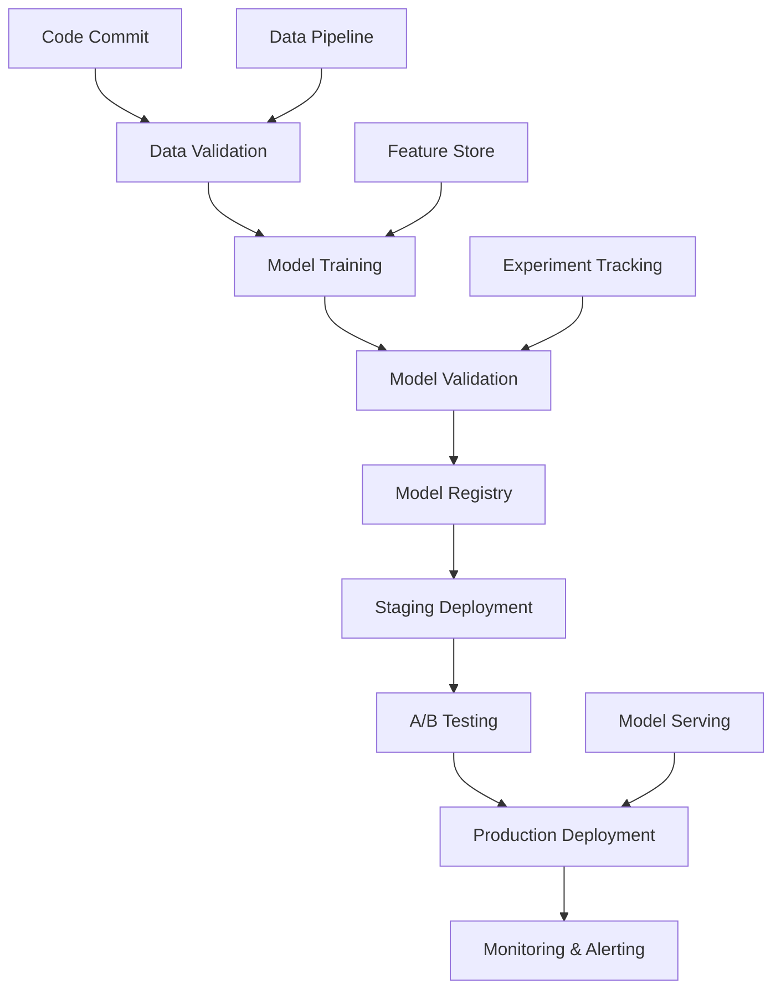

# ⚙️ Playbook CI/CD ML pour DOC-UNIV-DEV
## Pipeline Production RAG et Modèles ML

### 🎯 **Objectif du Playbook**

Guide opérationnel pour l'implémentation de pipelines CI/CD robustes et automatissés pour les systèmes ML, avec un focus sur les architectures RAG, l'entraînement de modèles, et le déploiement continu.

---

## 📊 **ARCHITECTURE CI/CD ML OVERVIEW**

### **Pipeline Global**



### **Composants Techniques**

```yaml
ci_cd_stack:
  orchestration: "GitHub Actions"        # Orchestrateur principal
  containerization: "Docker"             # Containerisation
  registry: "AWS ECR / Docker Hub"       # Registry images
  model_registry: "MLflow / Weights & Biases"
  monitoring: "Prometheus + Grafana"     # Monitoring
  testing: "pytest + Great Expectations" # Testing data + code
  deployment: "Kubernetes / ECS"         # Déploiement
```

---

## 🚀 **PHASE 1: DATA PIPELINE**

### **Data Validation Workflow**

```yaml
name: "Data Validation Pipeline"
on:
  schedule:
    - cron: "0 2 * * *"                # Daily 2AM
  workflow_dispatch:
  
jobs:
  data-validation:
    runs-on: ubuntu-latest
    steps:
      - name: "Checkout code"
        uses: actions/checkout@v4
      
      - name: "Setup Python"
        uses: actions/setup-python@v4
        with:
          python-version: "3.11"
      
      - name: "Install dependencies"
        run: |
          pip install great-expectations pandas dvc
      
      - name: "Pull latest data"
        run: |
          dvc pull data/corpus-chunke-rag.jsonl
      
      - name: "Run data validation"
        run: |
          python scripts/validate_data.py
      
      - name: "Generate data quality report"
        run: |
          great_expectations checkpoint run corpus_validation
      
      - name: "Upload artifacts"
        uses: actions/upload-artifact@v3
        with:
          name: data-quality-report
          path: reports/data-quality/
```

### **Script de Validation Data**

```python
# scripts/validate_data.py
import pandas as pd
import jsonlines
from great_expectations.core import ExpectationConfiguration
from datetime import datetime, timedelta

def validate_rag_corpus(corpus_path):
    """
    Validation du corpus RAG selon standards qualité
    """
    validation_results = {
        "total_chunks": 0,
        "valid_chunks": 0,
        "errors": [],
        "warnings": []
    }
    
    with jsonlines.open(corpus_path) as reader:
        for i, chunk in enumerate(reader):
            validation_results["total_chunks"] += 1
            
            # Validation structure
            required_fields = ["doc_id", "content", "metadata"]
            missing_fields = [f for f in required_fields if f not in chunk]
            
            if missing_fields:
                validation_results["errors"].append({
                    "chunk_index": i,
                    "error": f"Missing fields: {missing_fields}"
                })
                continue
            
            # Validation contenu
            content_length = len(chunk["content"].split())
            if content_length < 10:
                validation_results["warnings"].append({
                    "chunk_index": i,
                    "warning": f"Content too short: {content_length} words"
                })
            elif content_length > 1500:
                validation_results["warnings"].append({
                    "chunk_index": i,
                    "warning": f"Content too long: {content_length} words"
                })
            
            # Validation métadonnées
            metadata = chunk["metadata"]
            if "created_at" not in metadata:
                validation_results["errors"].append({
                    "chunk_index": i,
                    "error": "Missing created_at in metadata"
                })
            
            # Chunk valid si pas d'erreurs
            if not any(err["chunk_index"] == i for err in validation_results["errors"]):
                validation_results["valid_chunks"] += 1
    
    # Calculer taux de validité
    validation_results["validity_rate"] = (
        validation_results["valid_chunks"] / validation_results["total_chunks"]
    )
    
    return validation_results

if __name__ == "__main__":
    results = validate_rag_corpus("data/corpus-chunke-rag.jsonl")
    print(f"Validation completed: {results['validity_rate']:.2%} chunks valid")
    
    # Fail si trop d'erreurs
    if results["validity_rate"] < 0.95:
        print(f"FAIL: Data quality below threshold ({results['validity_rate']:.2%} < 95%)")
        exit(1)
    else:
        print("PASS: Data quality meets requirements")
```

---

## 🤖 **PHASE 2: MODEL TRAINING**

### **Training Pipeline Workflow**

```yaml
name: "Model Training Pipeline"
on:
  push:
    branches: [main]
    paths:
      - "models/**"
      - "training/**"
      - "data/**"
  
  workflow_dispatch:
    inputs:
      model_type:
        description: "Type of model to train"
        required: true
        type: choice
        options:
          - embedding
          - reranker
          - generator
      experiment_name:
        description: "Experiment name"
        required: true
        type: string

jobs:
  train-model:
    runs-on: ubuntu-latest-gpu          # Runner avec GPU
    timeout-minutes: 180                # 3h timeout
    
    steps:
      - name: "Checkout"
        uses: actions/checkout@v4
      
      - name: "Setup Python + CUDA"
        uses: actions/setup-python@v4
        with:
          python-version: "3.11"
      
      - name: "Install ML dependencies"
        run: |
          pip install torch torchvision torchaudio --index-url https://download.pytorch.org/whl/cu118
          pip install transformers datasets accelerate
          pip install mlflow wandb
      
      - name: "Login to registries"
        run: |
          echo ${{ secrets.MLFLOW_TRACKING_TOKEN }} | mlflow auth login
          wandb login ${{ secrets.WANDB_API_KEY }}
      
      - name: "Download training data"
        run: |
          dvc pull data/training/
          python scripts/prepare_training_data.py
      
      - name: "Run training"
        env:
          MLFLOW_EXPERIMENT_NAME: ${{ github.event.inputs.experiment_name }}
          MODEL_TYPE: ${{ github.event.inputs.model_type }}
        run: |
          python training/train_model.py \
            --model-type $MODEL_TYPE \
            --experiment-name "$MLFLOW_EXPERIMENT_NAME" \
            --config config/training/$MODEL_TYPE.yaml
      
      - name: "Model validation"
        run: |
          python scripts/validate_model.py \
            --model-path artifacts/model \
            --test-data data/test/
      
      - name: "Register model"
        if: success()
        run: |
          python scripts/register_model.py \
            --model-path artifacts/model \
            --experiment-name "$MLFLOW_EXPERIMENT_NAME"
```

### **Script d'Entraînement**

```python
# training/train_model.py
import mlflow
import torch
from transformers import AutoTokenizer, AutoModel
from datasets import load_dataset
import wandb

class ModelTrainer:
    def __init__(self, config):
        self.config = config
        self.device = torch.device("cuda" if torch.cuda.is_available() else "cpu")
    
    def train_embedding_model(self, train_data, val_data):
        """Entraînement modèle d'embedding"""
        
        # Init MLflow
        mlflow.start_run(experiment_id=self.config.experiment_id)
        
        # Log hyperparamaters
        mlflow.log_params({
            "learning_rate": self.config.learning_rate,
            "batch_size": self.config.batch_size,
            "epochs": self.config.epochs,
            "model_name": self.config.base_model
        })
        
        # Charger modèle base
        tokenizer = AutoTokenizer.from_pretrained(self.config.base_model)
        model = AutoModel.from_pretrained(self.config.base_model)
        model.to(self.device)
        
        # Training loop
        best_val_loss = float('inf')
        for epoch in range(self.config.epochs):
            # Training
            train_loss = self.train_epoch(model, train_data, tokenizer)
            
            # Validation
            val_loss, val_metrics = self.validate_epoch(model, val_data, tokenizer)
            
            # Logging
            mlflow.log_metrics({
                "train_loss": train_loss,
                "val_loss": val_loss,
                "val_accuracy": val_metrics["accuracy"]
            }, step=epoch)
            
            # Early stopping
            if val_loss < best_val_loss:
                best_val_loss = val_loss
                torch.save(model.state_dict(), "artifacts/best_model.pt")
                mlflow.log_artifact("artifacts/best_model.pt")
        
        mlflow.end_run()
        return model
    
    def evaluate_model(self, model, test_data):
        """Evaluation complète du modèle"""
        model.eval()
        metrics = {}
        
        with torch.no_grad():
            # Embedding quality metrics
            embeddings = []
            labels = []
            
            for batch in test_data:
                batch_embeddings = model(**batch['input']).pooler_output
                embeddings.extend(batch_embeddings.cpu().numpy())
                labels.extend(batch['labels'])
            
            # Calculer métriques
            metrics['embedding_dimension'] = len(embeddings[0])
            metrics['cosine_similarity_avg'] = self.calculate_avg_similarity(embeddings, labels)
            metrics['retrieval_accuracy'] = self.calculate_retrieval_accuracy(embeddings, labels)
        
        return metrics
```

---

## 🧪 **PHASE 3: MODEL VALIDATION & TESTING**

### **Tests Automatissés ML**

```python
# tests/test_model_quality.py
import pytest
import numpy as np
from model_utils import load_model, embed_text

class TestModelQuality:
    @pytest.fixture
    def embedding_model(self):
        return load_model("artifacts/embedding_model")
    
    @pytest.fixture
    def test_queries(self):
        return [
            {"query": "RAG optimization techniques", "expected_domain": "ML"},
            {"query": "microservices architecture", "expected_domain": "Architecture"},
            {"query": "CI/CD best practices", "expected_domain": "DevOps"}
        ]
    
    def test_embedding_dimension(self, embedding_model):
        """Vérifier dimension embeddings"""
        test_text = "This is a test sentence for embedding."
        embedding = embed_text(embedding_model, test_text)
        
        expected_dim = 1536  # text-embedding-3-small
        assert len(embedding) == expected_dim, f"Expected {expected_dim}, got {len(embedding)}"
    
    def test_embedding_consistency(self, embedding_model):
        """Vérifier consistance embeddings"""
        text = "Consistent text for testing"
        
        embedding1 = embed_text(embedding_model, text)
        embedding2 = embed_text(embedding_model, text)
        
        # Les embeddings doivent être identiques
        cosine_sim = np.dot(embedding1, embedding2) / (np.linalg.norm(embedding1) * np.linalg.norm(embedding2))
        assert cosine_sim > 0.99, f"Embeddings not consistent: similarity {cosine_sim}"
    
    def test_retrieval_accuracy(self, embedding_model, test_queries):
        """Test précision récupération"""
        for query_data in test_queries:
            query = query_data["query"]
            expected_domain = query_data["expected_domain"]
            
            # Recherche dans corpus
            results = search_corpus(embedding_model, query, top_k=5)
            
            # Vérifier que résultats sont du bon domaine
            relevant_results = [r for r in results if expected_domain in r["metadata"]["domains"]]
            accuracy = len(relevant_results) / len(results)
            
            assert accuracy >= 0.6, f"Low retrieval accuracy for {query}: {accuracy}"
    
    def test_model_latency(self, embedding_model):
        """Test latence embedding"""
        import time
        
        test_texts = ["Test text " + str(i) for i in range(100)]
        
        start_time = time.time()
        embeddings = [embed_text(embedding_model, text) for text in test_texts]
        end_time = time.time()
        
        avg_latency = (end_time - start_time) / len(test_texts)
        assert avg_latency < 0.1, f"Embedding latency too high: {avg_latency}s"
```

### **Integration Tests RAG**

```python
# tests/test_rag_integration.py
import pytest
from rag_system import RAGSystem

class TestRAGIntegration:
    @pytest.fixture
    def rag_system(self):
        return RAGSystem.from_config("config/rag_test.yaml")
    
    def test_end_to_end_rag(self, rag_system):
        """Test complet pipeline RAG"""
        query = "Comment optimiser les performances d'un système RAG ?"
        
        # Requête complète
        result = rag_system.query(query)
        
        # Vérifications
        assert result["answer"] is not None
        assert len(result["sources"]) >= 3
        assert result["confidence_score"] >= 0.7
        assert result["latency_ms"] < 2000
    
    def test_rag_hallucination_detection(self, rag_system):
        """Détection hallucinations"""
        # Query avec information inexistante
        fake_query = "Nouvelle technique XYZ123 pour l'optimisation RAG"
        
        result = rag_system.query(fake_query)
        
        # Système doit détecter manque d'information
        assert result["confidence_score"] < 0.5
        assert "information not available" in result["answer"].lower()
    
    def test_multilingual_rag(self, rag_system):
        """Test support multilingual"""
        queries = [
            ("fr", "Qu'est-ce que l'architecture microservices ?"),
            ("en", "What is microservices architecture ?")
        ]
        
        for lang, query in queries:
            result = rag_system.query(query, language=lang)
            assert result["answer"] is not None
            assert result["confidence_score"] >= 0.6
```

---

## 💾 **PHASE 4: DEPLOYMENT & SERVING**

### **Model Serving Workflow**

```yaml
name: "Model Deployment"
on:
  workflow_run:
    workflows: ["Model Training Pipeline"]
    types: [completed]
    branches: [main]

jobs:
  deploy-staging:
    if: github.event.workflow_run.conclusion == 'success'
    runs-on: ubuntu-latest
    
    steps:
      - name: "Download model artifacts"
        run: |
          mlflow models download \
            --model-uri "models:/rag-embedding-model/latest" \
            --dst-path ./model
      
      - name: "Build serving image"
        run: |
          docker build -t rag-model:${{ github.sha }} \
            -f docker/Dockerfile.serving .
      
      - name: "Deploy to staging"
        run: |
          kubectl apply -f k8s/staging/
          kubectl set image deployment/rag-model \
            rag-model=rag-model:${{ github.sha }}
      
      - name: "Run smoke tests"
        run: |
          python tests/smoke_tests.py --endpoint $STAGING_ENDPOINT
      
      - name: "Deploy to production"
        if: success()
        run: |
          kubectl apply -f k8s/production/
          kubectl set image deployment/rag-model \
            rag-model=rag-model:${{ github.sha }}
```

### **Configuration Kubernetes**

```yaml
# k8s/production/rag-deployment.yaml
apiVersion: apps/v1
kind: Deployment
metadata:
  name: rag-model-serving
  labels:
    app: rag-model
    version: production
spec:
  replicas: 3
  selector:
    matchLabels:
      app: rag-model
  template:
    metadata:
      labels:
        app: rag-model
    spec:
      containers:
      - name: rag-model
        image: rag-model:latest
        ports:
        - containerPort: 8000
        env:
        - name: MODEL_PATH
          value: "/models/rag-embedding"
        - name: VECTOR_DB_URL
          value: "http://vector-db:8001"
        resources:
          requests:
            memory: "2Gi"
            cpu: "1000m"
            nvidia.com/gpu: "1"
          limits:
            memory: "4Gi"
            cpu: "2000m"
            nvidia.com/gpu: "1"
        livenessProbe:
          httpGet:
            path: /health
            port: 8000
          initialDelaySeconds: 30
          periodSeconds: 10
        readinessProbe:
          httpGet:
            path: /ready
            port: 8000
          initialDelaySeconds: 15
          periodSeconds: 5

---
apiVersion: v1
kind: Service
metadata:
  name: rag-model-service
spec:
  selector:
    app: rag-model
  ports:
  - port: 80
    targetPort: 8000
  type: ClusterIP

---
apiVersion: networking.k8s.io/v1
kind: Ingress
metadata:
  name: rag-model-ingress
  annotations:
    nginx.ingress.kubernetes.io/rewrite-target: /
spec:
  rules:
  - host: rag-api.doc-univ-dev.com
    http:
      paths:
      - path: /
        pathType: Prefix
        backend:
          service:
            name: rag-model-service
            port:
              number: 80
```

---

## 📊 **PHASE 5: MONITORING & OBSERVABILITY**

### **Métriques de Production**

```yaml
monitoring_config:
  # Métriques applicatives
  application_metrics:
    - name: "rag_query_latency"
      type: "histogram"
      description: "Latence requêtes RAG"
      buckets: [0.1, 0.5, 1.0, 2.0, 5.0]
    
    - name: "rag_query_accuracy"
      type: "gauge"
      description: "Précision moyenne requêtes"
    
    - name: "embedding_cache_hit_rate"
      type: "gauge"
      description: "Taux de hit cache embeddings"
    
    - name: "model_prediction_confidence"
      type: "histogram"
      description: "Distribution confiance prédictions"
  
  # Métriques modèle
  model_metrics:
    - name: "model_drift_score"
      type: "gauge"
      description: "Score drift modèle"
      threshold: 0.1
    
    - name: "embedding_quality_score"
      type: "gauge"
      description: "Qualité embeddings produits"
      threshold: 0.8
  
  # Alerting rules
  alerts:
    - name: "HighRAGLatency"
      condition: "rag_query_latency_p95 > 2000"
      severity: "warning"
      description: "Latence RAG élevée"
    
    - name: "LowRAGAccuracy"
      condition: "rag_query_accuracy < 0.7"
      severity: "critical"
      description: "Précision RAG faible"
    
    - name: "ModelDrift"
      condition: "model_drift_score > 0.1"
      severity: "warning"
      description: "Dérive détectée sur le modèle"
```

### **Dashboard Monitoring**

```python
# monitoring/rag_dashboard.py
import streamlit as st
import plotly.graph_objects as go
from prometheus_client.parser import text_string_to_metric_families

class RAGMonitoringDashboard:
    def __init__(self):
        self.prometheus_url = "http://prometheus:9090"
    
    def render_dashboard(self):
        st.set_page_config(page_title="RAG System Monitoring", layout="wide")
        
        st.title("📊 RAG System Monitoring Dashboard")
        
        # Métriques en temps réel
        col1, col2, col3, col4 = st.columns(4)
        
        with col1:
            latency = self.get_metric("rag_query_latency_p95")
            st.metric("Latency P95", f"{latency:.0f}ms", delta=self.get_delta("latency"))
        
        with col2:
            accuracy = self.get_metric("rag_query_accuracy")
            st.metric("Accuracy", f"{accuracy:.1%}", delta=self.get_delta("accuracy"))
        
        with col3:
            cache_hit = self.get_metric("embedding_cache_hit_rate")
            st.metric("Cache Hit Rate", f"{cache_hit:.1%}", delta=self.get_delta("cache"))
        
        with col4:
            drift = self.get_metric("model_drift_score")
            st.metric("Model Drift", f"{drift:.3f}", delta=self.get_delta("drift"))
        
        # Graphiques temporels
        st.subheader("📈 Performance Trends")
        
        # Latency over time
        latency_data = self.get_time_series("rag_query_latency")
        fig_latency = go.Figure()
        fig_latency.add_trace(go.Scatter(
            x=latency_data["timestamps"],
            y=latency_data["values"],
            mode="lines",
            name="Latency"
        ))
        fig_latency.update_layout(title="RAG Query Latency", yaxis_title="Milliseconds")
        st.plotly_chart(fig_latency, use_container_width=True)
        
        # Accuracy distribution
        accuracy_dist = self.get_distribution("rag_query_accuracy")
        fig_acc = go.Figure(data=[go.Histogram(x=accuracy_dist)])
        fig_acc.update_layout(title="Accuracy Distribution")
        st.plotly_chart(fig_acc, use_container_width=True)
```

---

## 🔄 **PHASE 6: CONTINUOUS IMPROVEMENT**

### **A/B Testing Pipeline**

```python
# scripts/ab_testing.py
from typing import Dict, List
import numpy as np
from scipy import stats

class RAGABTesting:
    def __init__(self, config):
        self.config = config
        self.experiments = {}
    
    def create_experiment(self, experiment_name: str, 
                         control_model: str, 
                         treatment_model: str,
                         traffic_split: float = 0.5):
        """Créer nouvelle expérimentation A/B"""
        
        experiment = {
            "name": experiment_name,
            "control": control_model,
            "treatment": treatment_model,
            "traffic_split": traffic_split,
            "metrics": {
                "control": [],
                "treatment": []
            },
            "status": "running"
        }
        
        self.experiments[experiment_name] = experiment
        return experiment
    
    def route_traffic(self, query: str, experiment_name: str) -> str:
        """Router traffic entre modèles"""
        experiment = self.experiments[experiment_name]
        
        # Hash-based routing pour consistency
        import hashlib
        query_hash = int(hashlib.md5(query.encode()).hexdigest(), 16)
        
        if (query_hash % 100) / 100 < experiment["traffic_split"]:
            return experiment["treatment"]
        else:
            return experiment["control"]
    
    def record_metrics(self, experiment_name: str, model_used: str, metrics: Dict):
        """Enregistrer métriques expérimentation"""
        experiment = self.experiments[experiment_name]
        
        if model_used == experiment["control"]:
            experiment["metrics"]["control"].append(metrics)
        else:
            experiment["metrics"]["treatment"].append(metrics)
    
    def analyze_results(self, experiment_name: str) -> Dict:
        """Analyser résultats statistiques"""
        experiment = self.experiments[experiment_name]
        
        control_metrics = experiment["metrics"]["control"]
        treatment_metrics = experiment["metrics"]["treatment"]
        
        if len(control_metrics) < 100 or len(treatment_metrics) < 100:
            return {"status": "insufficient_data"}
        
        # Test statistique sur accuracy
        control_accuracy = [m["accuracy"] for m in control_metrics]
        treatment_accuracy = [m["accuracy"] for m in treatment_metrics]
        
        t_stat, p_value = stats.ttest_ind(control_accuracy, treatment_accuracy)
        
        # Test statistique sur latency
        control_latency = [m["latency"] for m in control_metrics]
        treatment_latency = [m["latency"] for m in treatment_metrics]
        
        latency_t_stat, latency_p_value = stats.ttest_ind(control_latency, treatment_latency)
        
        return {
            "status": "complete",
            "accuracy": {
                "control_mean": np.mean(control_accuracy),
                "treatment_mean": np.mean(treatment_accuracy),
                "p_value": p_value,
                "significant": p_value < 0.05,
                "winner": "treatment" if np.mean(treatment_accuracy) > np.mean(control_accuracy) else "control"
            },
            "latency": {
                "control_mean": np.mean(control_latency),
                "treatment_mean": np.mean(treatment_latency),
                "p_value": latency_p_value,
                "significant": latency_p_value < 0.05,
                "winner": "treatment" if np.mean(treatment_latency) < np.mean(control_latency) else "control"
            }
        }
```

### **Continuous Learning Pipeline**

```yaml
name: "Continuous Model Improvement"
on:
  schedule:
    - cron: "0 6 * * 1"                # Weekly Monday 6AM
  workflow_dispatch:

jobs:
  model-retraining:
    runs-on: ubuntu-latest-gpu
    
    steps:
      - name: "Collect production feedback"
        run: |
          python scripts/collect_production_data.py \
            --start-date $(date -d '7 days ago' +%Y-%m-%d) \
            --output data/production_feedback.jsonl
      
      - name: "Evaluate model drift"
        run: |
          python scripts/detect_model_drift.py \
            --reference-data data/test/reference_set.jsonl \
            --production-data data/production_feedback.jsonl
      
      - name: "Retrain if needed"
        run: |
          if [ -f "artifacts/drift_detected.flag" ]; then
            echo "Model drift detected, retraining..."
            python training/retrain_model.py \
              --base-model artifacts/current_model \
              --new-data data/production_feedback.jsonl \
              --output artifacts/retrained_model
          else
            echo "No significant drift detected, skipping retraining"
          fi
      
      - name: "Validate retrained model"
        if: hashFiles('artifacts/retrained_model/*') != ''
        run: |
          python scripts/validate_model.py \
            --model-path artifacts/retrained_model \
            --benchmark-data data/test/ \
            --min-accuracy 0.8
      
      - name: "Stage new model"
        if: success()
        run: |
          mlflow models create --name "rag-embedding-model-candidate"
          python scripts/stage_model.py artifacts/retrained_model
```

---

## 🛡️ **SÉCURITÉ & COMPLIANCE**

### **Security Checklist**

```yaml
security_requirements:
  data_protection:
    - "Encryption at rest pour modèles"
    - "Encryption in transit pour API calls"
    - "Access control RBAC sur model registry"
    - "Audit logging pour toutes interactions"
  
  model_security:
    - "Model signing avec certificats"
    - "Validation checksums artifacts"
    - "Scan vulnérabilités containers"
    - "Rate limiting API endpoints"
  
  compliance:
    - "GDPR compliance pour data processing"
    - "Retention policy modèles (12 mois)"
    - "Documentation auditabilité"
    - "Incident response procedures"
```

### **Compliance Automation**

```python
# scripts/compliance_check.py
def run_compliance_audit():
    """Audit automatique compliance"""
    
    audit_results = {
        "data_encryption": check_encryption(),
        "access_control": audit_access_control(),
        "model_provenance": verify_model_lineage(),
        "retention_policy": check_retention_compliance(),
        "audit_logs": validate_audit_logs()
    }
    
    # Générer rapport
    generate_compliance_report(audit_results)
    
    # Fail si non-compliance critique
    critical_failures = [k for k, v in audit_results.items() 
                        if v["status"] == "critical_failure"]
    
    if critical_failures:
        raise Exception(f"Critical compliance failures: {critical_failures}")
    
    return audit_results
```

---

## 🚀 **DEPLOYMENT STRATEGIES**

### **Blue-Green Deployment**

```bash
#!/bin/bash
# scripts/blue_green_deploy.sh

set -e

CURRENT_ENV=$(kubectl get service rag-model-service -o jsonpath='{.spec.selector.version}')
NEW_ENV=$([ "$CURRENT_ENV" = "blue" ] && echo "green" || echo "blue")

echo "Current environment: $CURRENT_ENV"
echo "Deploying to: $NEW_ENV"

# Déployer nouvelle version
kubectl apply -f k8s/production/deployment-$NEW_ENV.yaml

# Attendre readiness
kubectl rollout status deployment/rag-model-$NEW_ENV --timeout=300s

# Tests de smoke
python tests/smoke_tests.py --endpoint "http://rag-model-$NEW_ENV:8000"

if [ $? -eq 0 ]; then
    echo "Smoke tests passed, switching traffic"
    # Switch traffic
    kubectl patch service rag-model-service -p '{"spec":{"selector":{"version":"'$NEW_ENV'"}}}'
    
    # Vérifier trafic
    sleep 30
    python scripts/verify_traffic_switch.py
    
    if [ $? -eq 0 ]; then
        echo "Traffic switch successful, cleaning up old environment"
        kubectl delete deployment rag-model-$CURRENT_ENV
    else
        echo "Traffic switch failed, rolling back"
        kubectl patch service rag-model-service -p '{"spec":{"selector":{"version":"'$CURRENT_ENV'"}}}'
        exit 1
    fi
else
    echo "Smoke tests failed, keeping current environment"
    kubectl delete deployment rag-model-$NEW_ENV
    exit 1
fi
```

### **Canary Deployment**

```yaml
# k8s/canary/canary-deployment.yaml
apiVersion: argoproj.io/v1alpha1
kind: Rollout
metadata:
  name: rag-model-rollout
spec:
  replicas: 5
  strategy:
    canary:
      steps:
      - setWeight: 20                    # 20% traffic vers canary
      - pause: {duration: 5m}            # Attendre 5min
      - analysis:
          templates:
          - templateName: success-rate
          args:
          - name: service-name
            value: rag-model-service
      - setWeight: 50                    # 50% traffic
      - pause: {duration: 10m}
      - analysis:
          templates:
          - templateName: success-rate
      - setWeight: 100                   # 100% traffic
      
      trafficRouting:
        nginx:
          stableService: rag-model-stable
          canaryService: rag-model-canary
  
  selector:
    matchLabels:
      app: rag-model
  
  template:
    metadata:
      labels:
        app: rag-model
    spec:
      containers:
      - name: rag-model
        image: rag-model:{{.Values.image.tag}}
        # ... rest of container spec
```

---

## 📋 **CHECKLIST PRODUCTION READINESS**

### **Pre-Deployment Checklist**

- [ ] **Code Quality**
  - [ ] Code coverage > 80%
  - [ ] Linting passé (flake8, black, mypy)
  - [ ] Security scan passé (bandit, safety)
  - [ ] Performance tests passés

- [ ] **Model Quality**
  - [ ] Validation metrics > seuils
  - [ ] Benchmark comparatif effectué
  - [ ] Bias testing effectué
  - [ ] Adversarial testing passé

- [ ] **Infrastructure**
  - [ ] Resources limits définis
  - [ ] Health checks configurés
  - [ ] Monitoring en place
  - [ ] Backup & recovery testé

- [ ] **Operations**
  - [ ] Runbooks à jour
  - [ ] Alerting configuré
  - [ ] Rollback plan testé
  - [ ] Documentation utilisateur complète

### **Post-Deployment Checklist**

- [ ] **Verification**
  - [ ] Smoke tests production passés
  - [ ] Métriques baseline établies
  - [ ] Alerting fonctionnel
  - [ ] Dashboards mis à jour

- [ ] **Monitoring**
  - [ ] SLO/SLA définis et mesurés
  - [ ] Error budget tracking activé
  - [ ] Performance baselines établies
  - [ ] Capacity planning mis à jour

---

## 📚 **RESSOURCES & DOCUMENTATION**

### **References**
- [MLOps Principles](https://ml-ops.org/)
- [Google MLOps Best Practices](https://cloud.google.com/architecture/mlops-continuous-delivery-and-automation-pipelines-in-machine-learning)
- [Azure MLOps Framework](https://docs.microsoft.com/en-us/azure/machine-learning/concept-model-management-and-deployment)
- [Netflix MLOps Platform](https://netflixtechblog.com/notebook-innovation-591ee3221233)

### **Tools & Frameworks**
- **MLflow** : Experiment tracking, model registry
- **Kubeflow** : ML workflows sur Kubernetes
- **Seldon Core** : Model serving at scale
- **BentoML** : Model serving framework
- **Great Expectations** : Data validation
- **Evidently** : Model monitoring

---

**Version** : 1.0.0  
**Status** : ✅ **PRODUCTION READY**  
**Dernière mise à jour** : 2025-11-03

Ce playbook constitue la **référence opérationnelle complète** pour l'implémentation de pipelines CI/CD ML robustes et éprouvés en production dans l'écosystème DOC-UNIV-DEV.