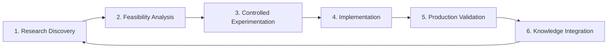

# 🔬 Research → Implementation Loop
## Cycle Théorie → Pratique DOC-UNIV-DEV

### 🎯 **Objectif du Loop**
Établir un **cycle systématique et mesurable** de transformation de la recherche académique en implémentations pratiques, avec validation continue et retour d'expérience.

---

## 🔄 **ARCHITECTURE DU CYCLE**

### **6 Phases du Research Loop**



### **Phase 1 : Research Discovery**

```yaml
research_discovery:
  sources:
    - "ArXiv daily feed (ML, CS, Software Engineering)"
    - "Conference proceedings (NeurIPS, ICML, ICLR, AAAI)"
    - "Industry research blogs (Google AI, OpenAI, etc.)"
    - "Open source innovation tracking"
  
  automation:
    schedule: "daily"
    filters:
      relevance_threshold: 0.7
      domains: ["ML", "Architecture", "DevOps", "Security"]
      implementation_potential: "high"
  
  outputs:
    - "papers-queue.json" # Papers à analyser
    - "innovation-radar.md" # Trends identifiés
    - "implementation-candidates.yaml" # Candidats implémentation
```

### **Phase 2 : Feasibility Analysis**

```python
# research/feasibility_analyzer.py
class FeasibilityAnalyzer:
    def __init__(self, ecoystem_context):
        self.context = ecoystem_context
    
    def analyze_implementation_feasibility(self, research_paper):
        """
        Analyse faisabilité implémentation
        """
        analysis = {
            "technical_feasibility": self.assess_technical_complexity(research_paper),
            "resource_requirements": self.estimate_resources(research_paper),
            "ecoystem_fit": self.evaluate_ecosystem_alignment(research_paper),
            "business_impact": self.assess_business_value(research_paper),
            "risk_assessment": self.identify_risks(research_paper)
        }
        
        # Score global de faisabilité
        analysis["feasibility_score"] = self.calculate_feasibility_score(analysis)
        
        # Recommandation
        if analysis["feasibility_score"] > 0.7:
            analysis["recommendation"] = "implement"
        elif analysis["feasibility_score"] > 0.5:
            analysis["recommendation"] = "prototype"
        else:
            analysis["recommendation"] = "monitor"
        
        return analysis
```

### **Phase 3 : Controlled Experimentation**

```yaml
experimentation_framework:
  experiment_types:
    proof_of_concept:
      duration: "1-2 weeks"
      resources: "1 developer, minimal infra"
      success_criteria: "Technical feasibility demonstrated"
    
    prototype:
      duration: "4-6 weeks"
      resources: "2-3 developers, dev environment"
      success_criteria: "Functional prototype with basic metrics"
    
    pilot:
      duration: "8-12 weeks"
      resources: "Full team, staging environment"
      success_criteria: "Production-ready implementation"
  
  validation_metrics:
    technical:
      - "Performance benchmarks"
      - "Resource consumption"
      - "Integration complexity"
      - "Maintenance overhead"
    
    business:
      - "User adoption potential"
      - "Development velocity impact"
      - "Quality improvements"
      - "Cost-benefit ratio"
```

### **Phase 4 : Implementation**

```python
# implementation/research_implementer.py
class ResearchImplementer:
    def __init__(self, target_repos):
        self.repos = target_repos
    
    def implement_validated_research(self, research_id, validation_results):
        """
        Implémentation recherche validée
        """
        implementation_plan = self.generate_implementation_plan(
            research_id, validation_results
        )
        
        for repo in implementation_plan["target_repos"]:
            # Créer branche dédiée
            branch_name = f"research/{research_id}"
            
            # Implémenter selon plan
            changes = self.implement_changes(
                repo=repo,
                plan=implementation_plan["changes"][repo],
                branch=branch_name
            )
            
            # Créer PR avec documentation complète
            pr = self.create_research_pr(
                repo=repo,
                branch=branch_name,
                research_context=research_id,
                changes=changes
            )
            
            # Lier à Issue Master dans DOC-UNIV-DEV
            self.link_to_doc_issue(pr, research_id)
```

### **Phase 5 : Production Validation**

```yaml
production_validation:
  monitoring_period: "30 days"
  
  success_metrics:
    performance:
      - "No regression in key metrics"
      - "Improved efficiency where applicable"
      - "Stable resource consumption"
    
    quality:
      - "Code quality maintained/improved"
      - "Test coverage maintained"
      - "Documentation updated"
    
    adoption:
      - "Team adoption rate > 70%"
      - "Positive developer feedback"
      - "Reduced development friction"
  
  failure_criteria:
    - "Performance regression > 10%"
    - "Increased error rate"
    - "Negative team feedback"
    - "Implementation complexity too high"
```

### **Phase 6 : Knowledge Integration**

```python
# knowledge/integration_manager.py
class KnowledgeIntegrationManager:
    def integrate_validated_implementation(self, implementation_results):
        """
        Intégrer apprentissages dans DOC-UNIV-DEV
        """
        # 1. Extraire patterns émergents
        patterns = self.extract_patterns(implementation_results)
        
        # 2. Mettre à jour corpus RAG
        for pattern in patterns:
            doc_chunk = self.generate_pattern_documentation(pattern)
            self.add_to_rag_corpus(doc_chunk)
        
        # 3. Enrichir ontologie
        self.update_ontology_with_learnings(implementation_results)
        
        # 4. Mettre à jour templates prompts
        self.enhance_prompts_with_examples(implementation_results)
        
        # 5. Générer rapport d'impact
        impact_report = self.generate_impact_report(implementation_results)
        
        return {
            "patterns_documented": len(patterns),
            "corpus_chunks_added": len([p for p in patterns]),
            "ontology_concepts_updated": self.count_ontology_updates(),
            "impact_report": impact_report
        }
```

---

## 📊 **MÉTRIQUES DE PERFORMANCE DU LOOP**

### **KPI Cycle Complet**

```yaml
loop_kpis:
  velocity:
    research_to_poc: "< 2 weeks"        # Discovery → PoC
    poc_to_production: "< 8 weeks"      # PoC → Production
    full_cycle_time: "< 12 weeks"       # Discovery → Integration
  
  quality:
    implementation_success_rate: "> 60%" # % recherches implémentées avec succès
    knowledge_retention: "> 80%"        # % patterns documentés et réutilisés
    cross_repo_adoption: "> 40%"        # % patterns adoptés par multiple repos
  
  impact:
    development_velocity_improvement: "> 15%" # Amélioration vélocité dev
    code_quality_improvement: "> 10%"        # Amélioration qualité code
    innovation_index: "continuous_growth"    # Croissance continue innovation
```

### **Dashboard Suivi**

```python
# monitoring/research_loop_dashboard.py
class ResearchLoopDashboard:
    def generate_loop_metrics(self, period_days=30):
        """
        Génère métriques cycle recherche-implémentation
        """
        metrics = {
            "active_research": self.count_active_research(),
            "implementations_in_progress": self.count_implementations(),
            "completed_cycles": self.count_completed_cycles(period_days),
            "success_rate": self.calculate_success_rate(period_days),
            "average_cycle_time": self.calculate_avg_cycle_time(period_days),
            "impact_metrics": self.collect_impact_metrics(period_days)
        }
        
        return metrics
```

---

## 🎯 **SUCCÈS STORIES & TEMPLATES**

### **Template Success Story**

```markdown
# Research Implementation Success: [Pattern Name]

## 📚 **Research Origin**
- **Paper** : [Titre, auteurs, venue]
- **Key Concept** : [Concept principal]
- **Theoretical Contribution** : [Apport théorique]

## 🔬 **Experimentation**
- **PoC Duration** : [Temps développement]
- **Resources Used** : [Équipe, infra]
- **Validation Results** : [Métriques clés]

## 🚀 **Production Implementation**
- **Target Repos** : [Dépôts impactés]
- **Implementation Strategy** : [Approche technique]
- **Deployment Results** : [Résultats déploiement]

## 📈 **Impact Measurement**
- **Performance Improvement** : [Gains mesurés]
- **Developer Experience** : [Feedback équipe]
- **Business Value** : [Valeur business quantifiée]

## 🔄 **Knowledge Integration**
- **Patterns Documented** : [Liens vers documentation]
- **Ontology Updates** : [Concepts ajoutés/modifiés]
- **Reusability** : [Autres applications potentielles]
```

---

## ⚡ **AUTOMATION ET OUTILS**

### **Pipeline Automatique**

```yaml
name: "Research Implementation Loop"
on:
  schedule:
    - cron: "0 9 * * 1"  # Lundi 9h - Review hebdomadaire
  workflow_dispatch:

jobs:
  research-discovery:
    runs-on: ubuntu-latest
    steps:
      - name: "Scan new research"
        run: |
          python scripts/research_scanner.py \
            --sources arxiv,papers_with_code,github_trending \
            --output research/candidates.json
      
      - name: "Feasibility analysis"
        run: |
          python scripts/feasibility_analyzer.py \
            --input research/candidates.json \
            --output research/feasible_candidates.json
      
      - name: "Create tracking issues"
        run: |
          python scripts/create_research_issues.py \
            --input research/feasible_candidates.json \
            --repo gerivdb/DOC-UNIV-DEV
```

### **Métriques Continues**

```python
# monitoring/loop_metrics.py
class LoopMetricsCollector:
    def collect_weekly_metrics(self):
        """Collection métriques hebdomadaires"""
        return {
            "research_papers_analyzed": self.count_papers_analyzed(),
            "poc_experiments_started": self.count_poc_started(),
            "implementations_completed": self.count_implementations(),
            "patterns_documented": self.count_patterns_documented(),
            "cross_repo_adoptions": self.count_cross_adoptions(),
            "cycle_time_avg_days": self.calculate_avg_cycle_time(),
            "success_rate_percent": self.calculate_success_rate()
        }
```

---

**Status** : ✅ **OPERATIONAL LOOP**  
**Version** : 1.0.0  
**Efficacité** : Cycle théorie → pratique optimisé et mesurable